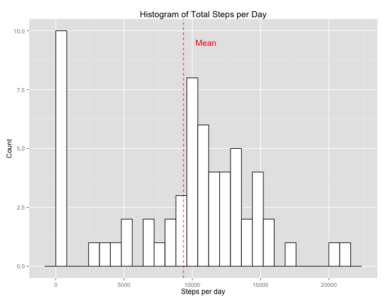
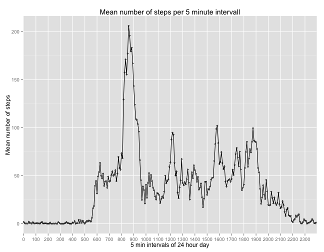
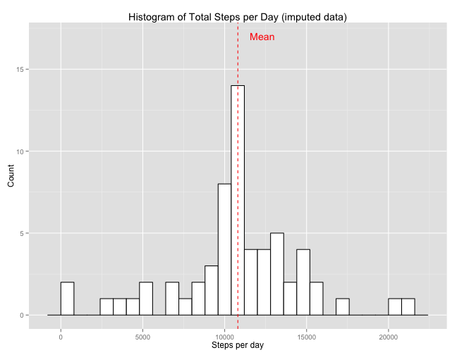
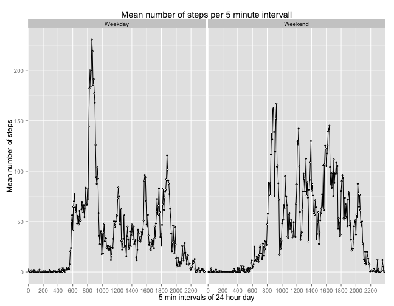

<br><br>

### Loading and preprocessing of the data  


```r
library(dplyr)
library(ggplot2)
data <- read.csv("activity.csv")
data = as.tbl(data)
data$date <- as.Date(data$date)
data$interval <- as.factor(data$interval)
```
  
<br><br>


### What is the mean total number of steps taken per day?  

```r
##  Creates a Dataframe that sums all steps for every single day
x <- summarise(group_by(data, date), total = sum(steps, na.rm = TRUE))

##  Plots a histogramm for the above calculated sum,
ggplot(x, aes(x=total)) +
        geom_histogram(binwidth = 800, colour="black", fill="white") +
        geom_vline(aes(xintercept=mean(x$total, na.rm=T)), 
                color="red", linetype="dashed", size=0.5) +
        labs(title="Histogram of Total Steps per Day") +
        labs(x="Steps per day", y="Count") +
        annotate("text", label = "Mean", x = 11000, y = 9.5, size = 5, color="red")
```

 

<br><br>

#### Mean and median number of steps taken per day:  

```r
##  Calculates the mean and median of total steps
a <- summarise(x, Mean_total_steps = mean(total, na.rm = TRUE), 
                  Median_total_steps = median(total, na.rm = TRUE))
```

<br><br>

Mean of total Steps per Day        | Median of total Steps per Day
-----------------------------------|-------------------------------
9354.23|10395

<br><br>
  
### What is the average daily activity pattern?


```r
##  Calculates the mean numer of steps taken in each 5 min interval
b <- summarise(group_by(data, interval), mean_steps = mean(steps, na.rm = TRUE))

##  Plots a time series of the mean number of steps per interval created above
ggplot(b, aes(x=interval, y=mean_steps, group=1)) +
        geom_line() +
        labs(title="Mean number of steps per 5 minute intervall") + 
        labs(x="5 min intervals of 24 hour day", y="Mean number of steps") +
        geom_point(colour="black", size=1, shape=21, fill="white") +
        scale_x_discrete(breaks=seq(0,2400,100))
```

 
<br><br>

```r
##  Identifies the interval with the highest mean number of steps
max_mean_steps <- b[b$mean_steps == max(b$mean_steps),]
```


#### 5 minute intervall with highest average number of steps
Intervall       |Mean Number of steps
----------------------|---------------------
835 |206.1698113

<br><br>

### Imputing missing values   

#### Total number of incomplete observations:

```r
##  Calculating the number of observations without missing values
nas <- sum(!complete.cases(data))
```

There are a total of **2304** missing values in the dataset.

<br><br>

#### Imputation of missing values and creation of a complete imputed dataset:   

To impute the missing values, a linear model is created to predict the amount of steps taken by
date and interval. One is added to each non-missing step variable in fitting the model to prevent 
the y intersect from beeing negative; imputed "negative steps" would have no meaning. The predicted 
value for each missing variable is set to 0 if it's smaller than 1 and rounded in all other cases.


```r
##  Creates a linear regression model to predict the steps variable
lm_impute <- lm(steps+1 ~ date + interval, data = data, subset = !is.na(data$steps))

##  Creates a vector with the predictes values for steps given date and interval
prediction <- predict (lm_impute, data) 

##  Defines a function that checks for and substitutes missing values with their predicted values.
imputation <- function(x, x_predicted) {
  if (is.na(x)) { 
    ifelse(x_predicted >= 1, round(x_predicted),0)
    } else {x}                                
}

##  Creates the basis for the new imputed data frame
data_imputed <- data

##  Applies the above defiened function to the new data frame.
for(i in 1:nrow(data)) {
  data_imputed[i,1] <- imputation(data$steps[i], prediction[i])
}
```

<br><br>

#### Histogramm of total numbers of steps taken each day (imputed data)


```r
##  Calculates the total amount of steps taken per day.
e <- summarise(group_by(data_imputed, date), total = sum(steps,na.rm=T))

##  Plots a histogramm of the above calculated sum.
ggplot(e, aes(x=total)) +
        geom_histogram(binwidth = 800, colour="black", fill="white") +
        geom_vline(aes(xintercept=mean(e$total, na.rm=T)), 
                   color="red", linetype="dashed", size=0.5) +
        labs(title="Histogram of Total Steps per Day (imputed data)") +
        labs(x="Steps per day", y="Count") +
        annotate("text", label = "Mean", x = 12300, y = 17, size = 5, color="red")
```

 

<br><br>


```r
##  Calculates the mean and median of total steps (imputed data)
g <- summarise(e, Mean_total_steps = mean(total, na.rm = TRUE), 
                  Median_total_steps = median(total, na.rm = TRUE))
```

<br><br>
 
Dataset        |Mean of total steps per day        | Median of total steps per day     
---------------|-----------------------------------|-----------------------------------
unimputed data |9354.23|10395
imputed data   |10803.26|11055

<br><br>

### Are there differences in activity patterns between weekdays and weekends?    


```r
##  Defines a function to label each observation as "Weekend" or "Weekday".
wday <- function(a){
     ifelse(a == "Saturday" | a == "Sunday","Weekend","Weekday")   
}

##  Uses that function to add the "Weekend" label, groups the dataset by interval and the new label
##  and calculates the mean total steps per day by these groups.
h <- data_imputed %>% mutate(weekend = wday(weekdays(date))) %>% 
                      group_by(interval, weekend) %>% 
                      summarise(mean_steps = mean(steps, na.rm = TRUE))
```

<br><br>


```r
## Plots a time series of the mean number of steps per interval created above for each "Weekend" label.
ggplot(h, aes(x = interval, y = mean_steps, group=1)) +
        geom_line() +
        labs(title="Mean number of steps per 5 minute intervall") + 
        labs(x="5 min intervals of 24 hour day", y="Mean number of steps") +
        geom_point(colour="black", size=1, shape=21, fill="white") +
        scale_x_discrete(breaks=seq(0,2400,200)) +
        facet_grid(. ~ weekend)
```

 

<br><br>

